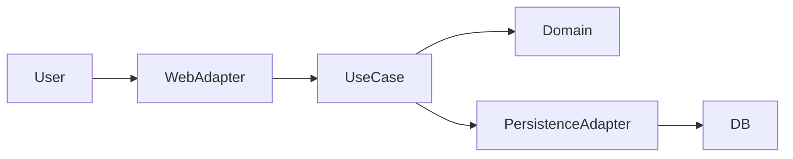

# Technical Documentation

## 🏗️ Architecture Overview
Describe the high-level design (e.g., Hexagonal Architecture).

### Component Diagram
Insert a Mermaid diagram or link to an image.

## 💻 Technology Stack
-   **Language**: Java 25
-   **Framework**: Spring Boot / Jakarta EE
-   **Database**: PostgreSQL
-   **Testing**: Spock (Sprock)

## 🗄️ Data Schema
Description of the main data entities and their relationships.

## 🔌 Integration Points
List external APIs or systems this application connects to.
-   **API Name**: Purpose and authentication method.

## 🛠️ Developer Guide
-   How to debug.
-   Logging standards.
-   Error handling strategy.
